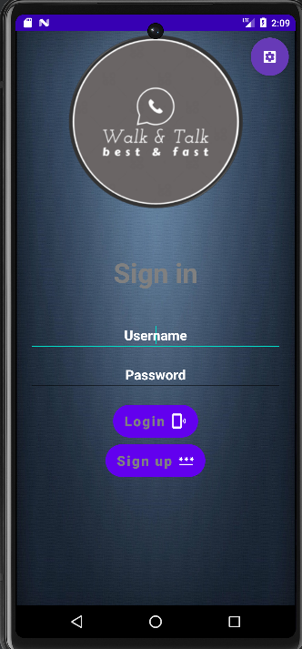
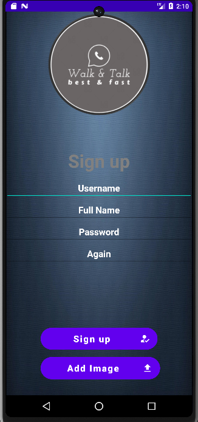
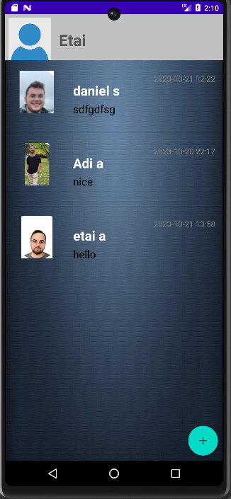
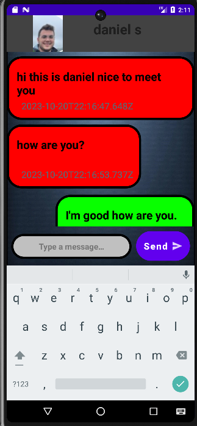
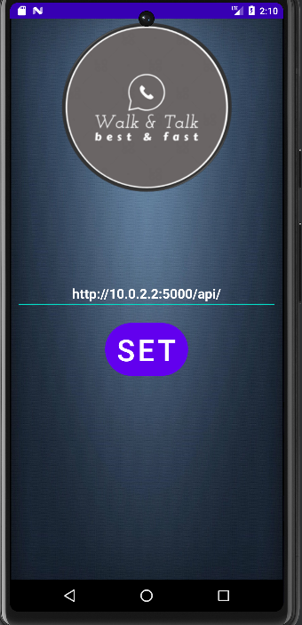

# ADE Chat Android


## General Information
This project is an application that  allows users to register, log in, and engage in chat conversations with other contacts.

The Chat-Application is a web-based chatbot that provides a user-friendly interface for seamless communication. It offers the following features:

### Login screen:
Users can authenticate themselves by entering their credentials.



<br>
<br> 
### Registration screen

New users can create an account by providing the necessary details.




### Chat list screen:

Displays a list of chats with contacts. Once logged in, users can view their contacts and engage in real-time chat conversations.



### Single Chat screen: 

Opens a chat conversation with a selected contact.



### Settings screen:
Allows editing relevant application settings, such as the server address and theme.


## Setup

1. Make sure you have nodeJS, npm, and MongoDB installed on your local machine, and the MongoDB is running.

2. Clone the repository to your local machine:
```
https://github.com/EtaiWil/ADE_ChatAndroid.git
 ```
  

#### To start the server
1. Navigate to the folder where you cloned the repository 
2. Navigate to the folder of the server by executing the command ``` cd Server ```
3. execute the command ``` npm install ``` to download node_modules folder for the server.
4. execute the command ``` npm start ``` to start the server.

#### To start the android app:
1.Start the app on the emulator by pressing the green button.


## Built With

Frontend (Android Client)

- Java
- XML


### Backend (MVC)
- Node.js
- Express.js
- MongoDB
- SQLite


## Authors

**Etai Wilentzik**
* [Profile](https://github.com/EtaiWil )
  <br>

**Daniel Singer**
- [Profile](https://github.com/DanielSInger1 )

**Adi Tal**
- [Profile](https://github.com/adital2512 )

### bouns fact ### 
ADE chat is an acronym of Adi Daniel Etai 😀


## Support 🤝

Contributions, issues, and feature requests are welcome!

Give a ⭐️ if you like this project!

